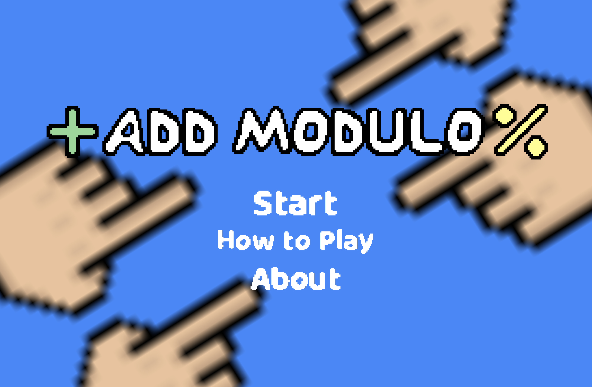
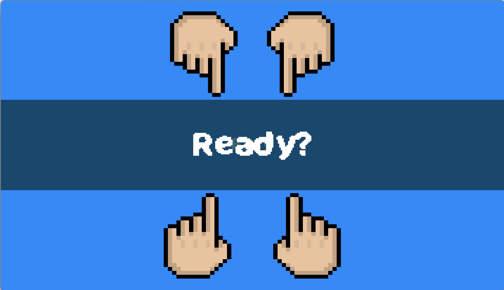
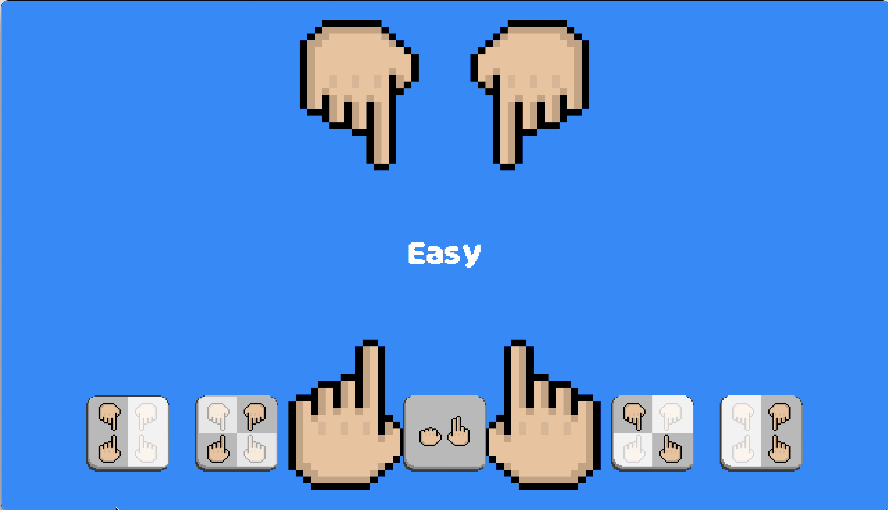
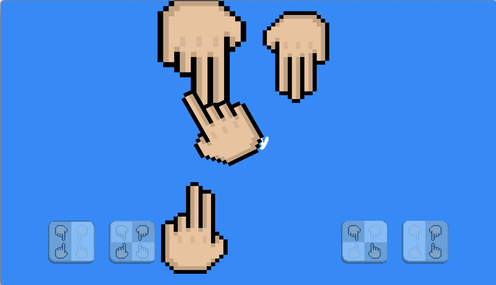
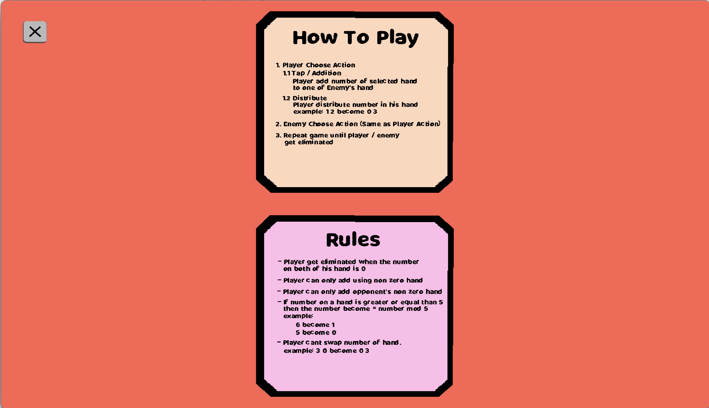
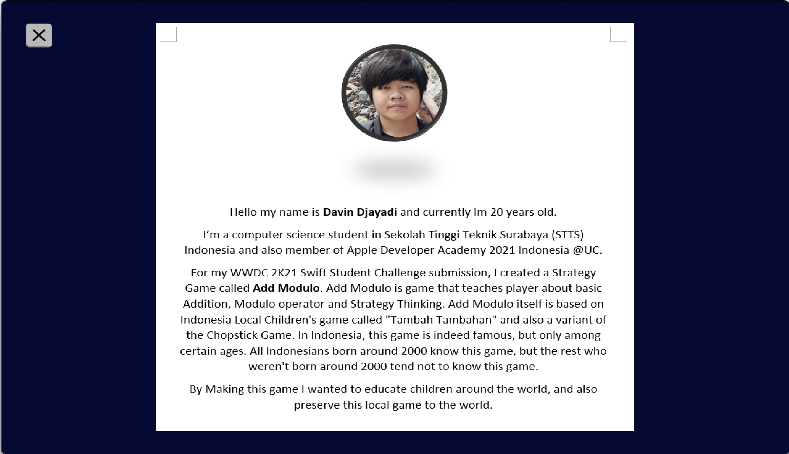

# Add Modulo
__Add Modulo__ is a strategy game for my [WWDC 2021 Swift Student Challenge](https://developer.apple.com/wwdc21/swift-student-challenge/) Submission. And thankfully __Add Modulo__ makes me __1__ of __350__ [WWDC2021 Scholarship](https://www.wwdcscholars.com/2021) Winners :D

My WWDC Profile: [>> Portal <<](https://www.wwdcscholars.com/s/0A052450-0317-4FAF-A493-B4F9A4AE1771)

## About Add Modulo
---
__Add Modulo__ is a game that teaches player about basic Addition, [Modulo operator](https://en.wikipedia.org/wiki/Modulo_operation) and Strategy Thinking. This game itself is based on [Indonesia](https://en.wikipedia.org/wiki/Indonesia) Local Children's game called "Tambah Tambahan" and also a variant of the [Chopstick](https://en.wikipedia.org/wiki/Chopsticks_(hand_game)) Game. In Indonesia, this game is indeed famous, but only among certain ages. All Indonesians born around 2000 know this game, but the rest who weren't born around 2000 tend not to know this game. 

By Making this game I wanted to educate children around the world, and also preserve this local game to the world.

## How to Play Add Modulo
---
1. __Player Choose Action__
    1. __Tap / Addition__  
        Player add number of selected hand 
        to one of other player's hand
    2. __Distribute__  
        Player distribute number in his hand
        example: 1 2 become 0 3
 2. __Other player choose action__ (same as player's action)
 3. __Repeat game until one of the players get eliminated__

## Add Modulo Rules
---
 - Player get eliminated when the number on both of his hand is 0
 - Player can only add using non zero hand
 - Player can only add opponent's non zero hand
 - If number on a hand is greater or equal than 5 then the number become 
 number mod 5  
    example:   
    - 6 become 1   
    - 5 become 0
 - Player cant swap number of hand.  
    example:  
    - 3 0 become 0 3

## How to Run Add Modulo Project
---
1. Clone this project
2. Open __Add Modulo.playground__ in [Swift Playground](https://www.apple.com/swift/playgrounds/)
3. In Swift Playground, Turn off __Enable Results__
4. Enjoy :D

## Preview
---

## Disclaimer
---
For sound assets, its not made by me, I take the asset
in the online marketplace called itch.io
 
For image assets, its made by me and my friend

Beside that, all assets are made by me

## Credit
---
Coming soon...